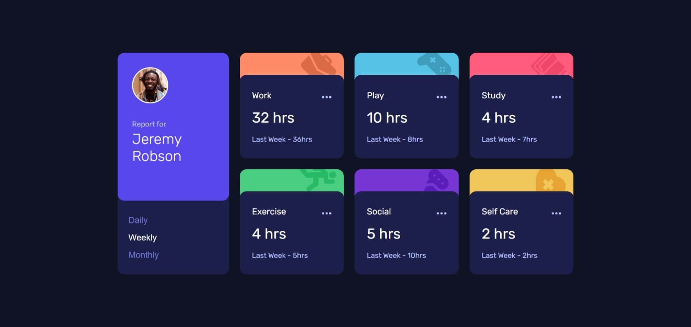
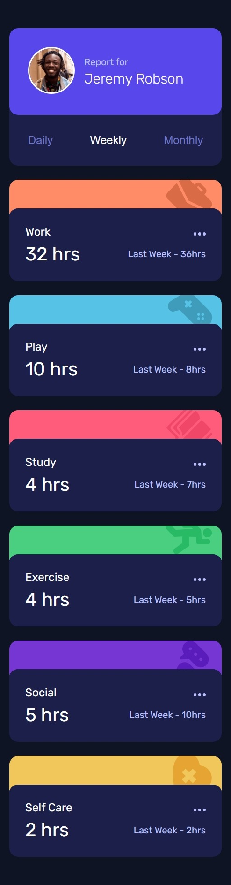

# Frontend Mentor - Time tracking dashboard solution

This is a solution to the [Time tracking dashboard challenge on Frontend Mentor](https://www.frontendmentor.io/challenges/time-tracking-dashboard-UIQ7167Jw). Frontend Mentor challenges help you improve your coding skills by building realistic projects. 

## Table of contents

- [Overview](#overview)
  - [The challenge](#the-challenge)
  - [Screenshot](#screenshot)
  - [Links](#links)
- [My process](#my-process)
  - [Built with](#built-with)
  - [What I learned](#what-i-learned)
  - [Continued development](#continued-development)
  - [Useful resources](#useful-resources)
  - [AI Collaboration](#ai-collaboration)
- [Author](#author)
- [Acknowledgments](#acknowledgments)


## Overview

### The challenge

Users should be able to:

- View the optimal layout for the site depending on their device's screen size
- See hover states for all interactive elements on the page
- Switch between viewing Daily, Weekly, and Monthly stats

### Screenshot





### Links

- Solution URL: [Add solution URL here](https://github.com/My-Frontend-Mentors-Challenges/time-tracking-dashboard-main)
- Live Site URL: [Add live site URL here](https://my-frontend-mentors-challenges.github.io/time-tracking-dashboard-main/)

## My process

### Built with

- Semantic HTML5 markup
- CSS custom properties
- Flexbox
- CSS Grid
- Mobile-first workflow
- JavaScript
- Dom Manipulation


### What I learned

```css
li:hover:not(:has(button:hover))::before {
  background-color: var(--Navy-800);
}
```
working with z-index and making img behind the background to I made a layer using ::before
```css
li>img{
    position: absolute;
    top: -5px;
    right: 1rem;
    z-index: 0;
}
li::before{
    content: '';
    position: absolute;
    inset: calc( var(--list-border-thinkness) - 1px) 0 0;
    background-color: var(--Navy-900);
    z-index: 1;
}
li>*:not(img){
    position: relative;
    z-index: 2;
}
```
making border but without canceling the border radius of the list background with box shadow,
inset wasn't really necessary here but I thought would be better to be part and inside the li element.
```css
li.work{
    box-shadow: inset 0 var(--list-border-thinkness) 0 -1px var(--Orange-300);
}
```
targeting the even ordered elements
```css
li>:nth-child(even){
    justify-self: end;
}
```
fetching data from data.json, manipulating dom especially the ul element, and actively update button statuses on clicking, and render data based on the active button. 